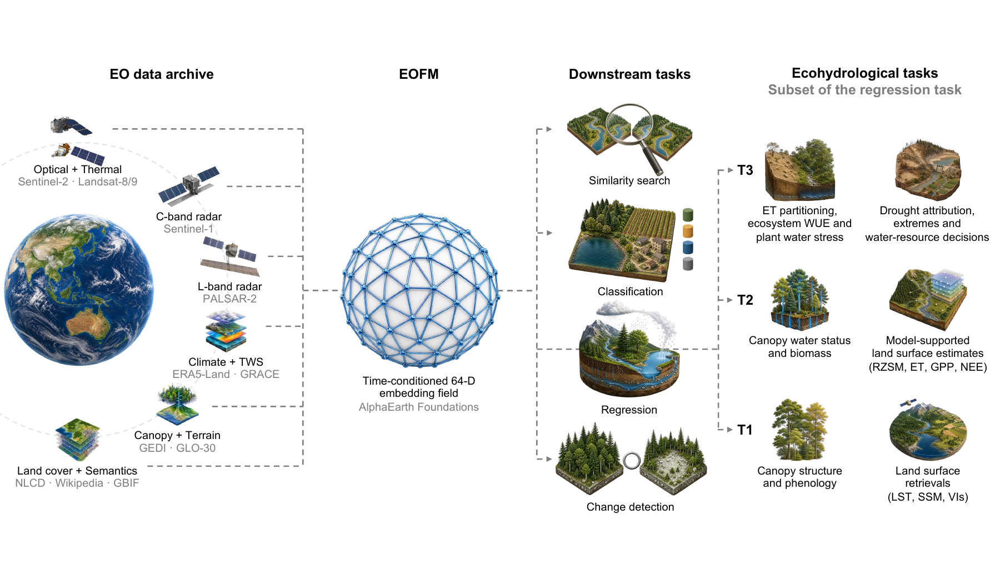

# EOFM4EcoHydrol

[](https://arxiv.org/abs/2608.15282)
[](https://creativecommons.org/licenses/by/4.0/)
[](#evidence-snapshot)

**Earth observation foundation models for terrestrial ecohydrology**

EOFM4EcoHydrol is the literature and data companion to the review [*Earth Observation Foundation Models for Terrestrial Ecohydrology: From Representation Learning to Process Inference*](https://arxiv.org/abs/2608.15282). The repository connects EOFM design with ecohydrological observability, application evidence, and benchmark requirements across coupled water, energy, vegetation, and carbon processes.

The catalogues retain primary-source links, evidence roles, validation context, and explicit data cutoffs. Third-party papers, model weights, code, and datasets remain with their original providers.



*EOFM4EcoHydrol overview from Fig. 2 of the companion preprint.*

## Explore by research question

The repository follows the analytical sequence of the review.

| Research question | Resource guide | Main files |
|---|---|---|
| **RQ1 · Inference** — How do EO signals and complementary data support ecohydrological inference, and where do observation physics, reference uncertainty, scale, and process constraints enter the chain? | [Observation-to-inference framework](rq1-inference/README.md) | [Inference contract](rq1-inference/inference-contract.md) · [key literature](rq1-inference/key-literature.csv) |
| **RQ2 · EOFM landscape** — Which modalities, supports, representation strategies, and adaptation routes are covered by current EOFMs, and which ecohydrological capabilities remain underrepresented? | [Model-landscape guide](rq2-eofm-landscape/README.md) | [60 model/version records](rq2-eofm-landscape/eofm-models.csv) · [91 publication records](rq2-eofm-landscape/publications.csv) · [dataset inventory](rq2-eofm-landscape/datasets.csv) |
| **RQ3 · Applications** — Which capabilities have been demonstrated across ecohydrological target classes, and how does evidence strength depend on observability, reference independence, and evaluation under shift? | [Application-evidence guide](rq3-applications/README.md) | [73 screened records, including 71 primary studies](rq3-applications/application-evidence.csv) |
| **RQ4 · Benchmarking** — Which benchmark designs and diagnostics are needed to evaluate accuracy, dynamics, physical consistency, uncertainty, transferability, and readiness for use? | [Benchmark-design guide](rq4-benchmarking/README.md) | [20-study evidence ledger](rq4-benchmarking/benchmark-evidence.csv) · [six-family blueprint](rq4-benchmarking/benchmark-blueprint.csv) · [context sources](rq4-benchmarking/context-sources.csv) |

## Evidence snapshot

This release mirrors the evidence base used for the August 2026 preprint.

| Corpus | Scope | Cutoff or status |
|---|---|---|
| EOFM meta-analysis | 2,106 search records, 722 deduplicated candidates, and 60 model/version records representing 52 families | Literature available through **31 July 2026** |
| Publication trends | 60 model descriptions, 15 reviews or perspectives, and 16 benchmark or evaluation studies | **91 records** |
| Application synthesis | 71 eligible primary EOFM application studies, plus two screening-context records retained for provenance | Search updated through **5 August 2026** |
| Benchmark audit | 10 general EOFM suites and 10 ecohydrological evaluations | **20 comparative studies** |
| Benchmark blueprint | Soil water and storage; surface energy and ET; carbon exchange and stocks; vegetation condition; catchment response; disturbance and recovery | **Six target families** |

The catalogues describe heterogeneous studies and evaluation designs. They do not calculate pooled effect sizes or an aggregate model ranking. Missing values indicate information that was unreported or unresolved at the evidence cutoff.

## Resource layout

```text
EOFM4EcoHydrol/
├── rq1-inference/          # Observation physics, inference tiers, and claim specification
├── rq2-eofm-landscape/     # Models, publications, and representation data resources
├── rq3-applications/       # Application-level evidence across ecohydrological targets
├── rq4-benchmarking/       # Benchmark audit, diagnostics, and target-first blueprint
├── paper/                  # Preprint metadata and the curated BibTeX library
├── assets/                 # Repository figures
└── sources/                # Provenance notes for repository design decisions
```

Each RQ directory begins with a short guide to the scientific question, the corresponding data fields, and appropriate interpretations. The CSV files provide the maintainable source of record; the Markdown files provide human-readable synthesis.

## Suggested ways to use the repository

- Start with [RQ1](rq1-inference/README.md) when defining an ecohydrological claim or reviewing target observability.
- Filter [the EOFM catalogue](rq2-eofm-landscape/eofm-models.csv) by observation pathway, temporal support, model family, release date, or adaptation route.
- Use [the application ledger](rq3-applications/application-evidence.csv) to locate evidence by target family, inference tier, reference directness, validation scope, and result direction.
- Use [the benchmark blueprint](rq4-benchmarking/benchmark-blueprint.csv) to design target-matched datasets, holdouts, and diagnostics.
- Search [the curated BibTeX library](paper/references.bib) for the papers cited in the review.

## Contributing

Suggestions for papers, EOFMs, datasets, benchmarks, corrections, and access updates are welcome. Please open a resource-suggestion issue or submit a pull request. Every proposed record should include a primary source, its relationship to one or more RQs, and enough evidence context to support the proposed coding. See [CONTRIBUTING.md](CONTRIBUTING.md) for the minimum metadata and review process.

## Citation

Please cite the preprint when using this synthesis or its curated evidence tables:

> Yu, Y., Peng, J., Lin, Y., Keenan, T. F. and Bishop, T. F. A. (2026). *Earth Observation Foundation Models for Terrestrial Ecohydrology: From Representation Learning to Process Inference*. arXiv:2608.15282. https://doi.org/10.48550/arXiv.2608.15282

```bibtex
@misc{yu2026eofm4ecohydrol,
  title         = {Earth Observation Foundation Models for Terrestrial Ecohydrology: From Representation Learning to Process Inference},
  author        = {Yu, Yi and Peng, Jian and Lin, Yucheng and Keenan, Trevor F. and Bishop, Thomas F. A.},
  year          = {2026},
  eprint        = {2608.15282},
  archiveprefix = {arXiv},
  primaryclass  = {cs.LG},
  doi           = {10.48550/arXiv.2608.15282},
  url           = {https://arxiv.org/abs/2608.15282}
}
```

Machine-readable citation metadata are available in [CITATION.cff](CITATION.cff).

## Licence

Original repository text, metadata curation, and figures are released under [CC BY 4.0](LICENSE.md). Linked third-party resources retain their original licences and access conditions.
